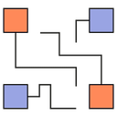

# Diagrams

**Diagram as Code**.

Diagrams lets you draw the cloud system architecture **in Python code**. It was born for **prototyping** a new system architecture design without any design tools. You can also describe or visualize the existing system architecture as well. Diagrams currently supports three major cloud providers: `AWS`, `Azure`, `GCP`.

**Diagram as Code** also allows you to **tracking** the architecture diagram changes on any **version control** system.

>  NOTE: It does not control any actual cloud resources nor generate cloud formation or terraform code, but just for drawing the cloud system architecture diagrams.

## Getting Started

It uses [Graphviz](https://www.graphviz.org/) to render the diagram, so you need to [install Graphviz](https://graphviz.gitlab.io/download/) to use **diagrams**. After installing graphviz (or already have it), install the **diagrams**.

> macOS users can download the Graphviz via `brew install graphviz` if you're using [Homebrew](https://brew.sh).

```shell
# using pip (pip3)
$ pip install diagrams

# using pipenv
$ pipenv install diagrams

# using poetry
$ poetry add diagrams
```

You can start with [quick start](https://diagrams.mingrammer.com/docs/installation#quick-start). And you can go [guides](https://diagrams.mingrammer.com/docs/diagram) for more details. 

## Examples

| Grouped Workers                                              | Clustered Web Services                                       | Event Processing                                             |
| ------------------------------------------------------------ | ------------------------------------------------------------ | ------------------------------------------------------------ |
|  |  |  |

You can find all the examples on the [examples](https://diagrams.mingrammer.com/docs/examples) page.

## Contributing

To contribute to diagram, check out [contribution guidelines](CONTRIBUTING.md).

> Let me know if you are using diagrams! I'll add you in showcase page. (I'm working on it!) :)

## License

[MIT](LICENSE.md)
